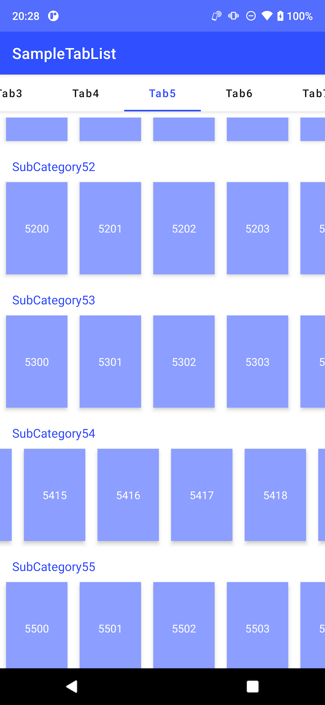

# SampleTabList

This is an Android sample code for using TabLayout, ViewPager and ListAdapter. This app dynamically generates non-fixed size of tabs, list adapters.

If JDK error happens, set your Android Studio to use Gradle JDK 11. 
[Preferences] > [Build, Execution, Deployment] > [Build Tools] > [Gradle]

